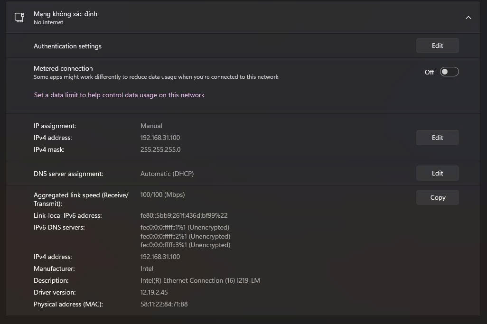
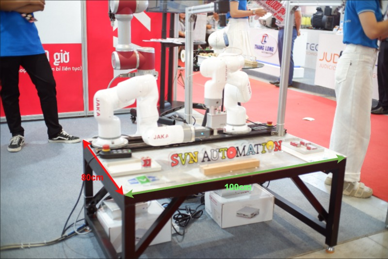
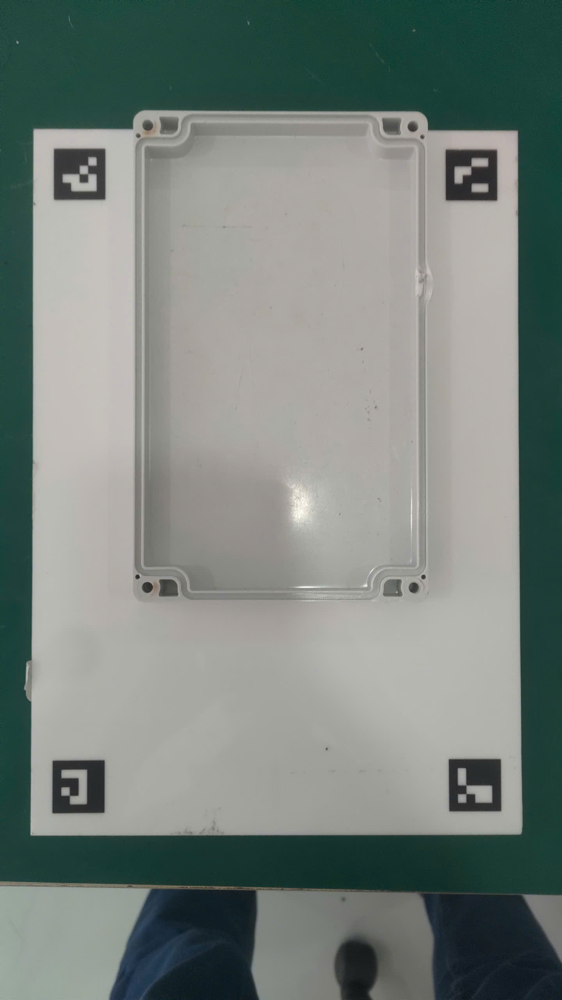
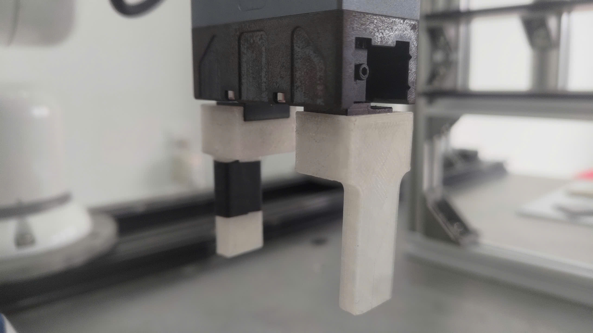
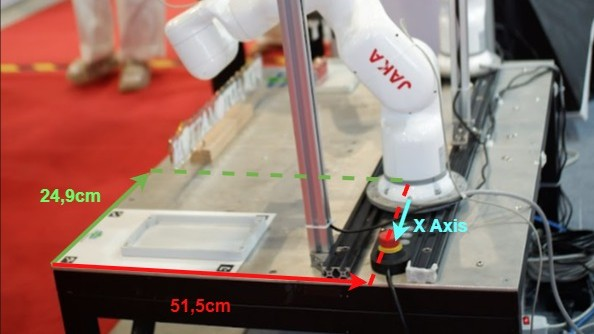
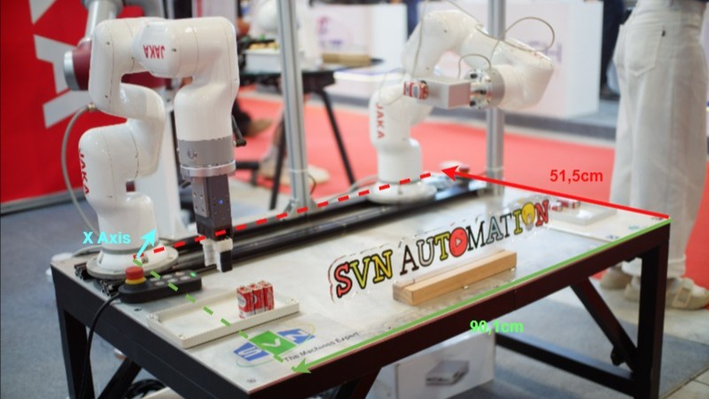
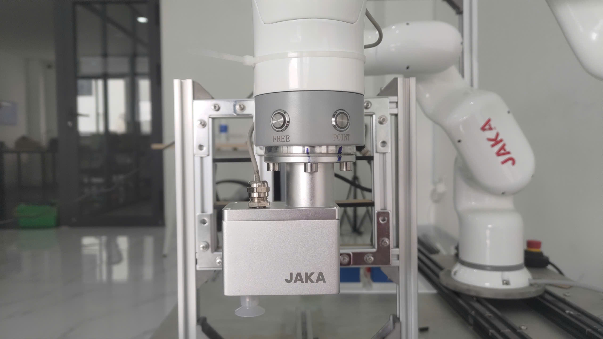
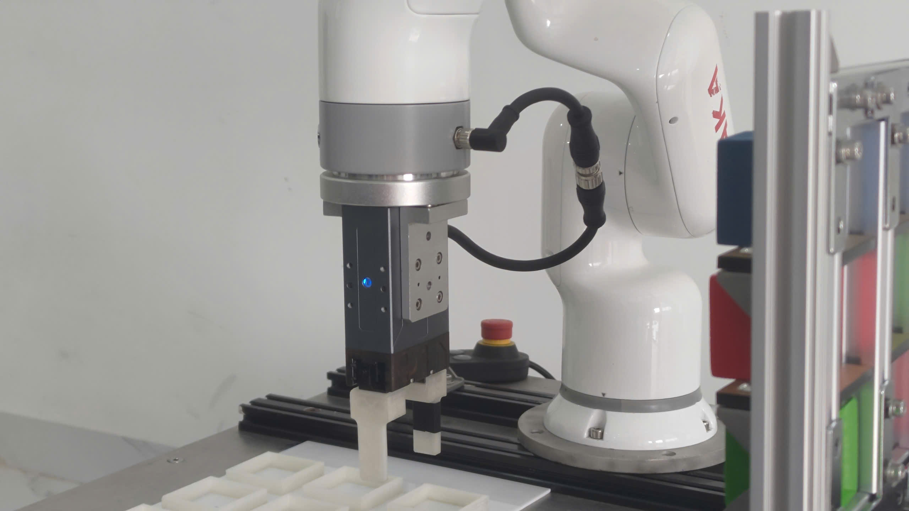
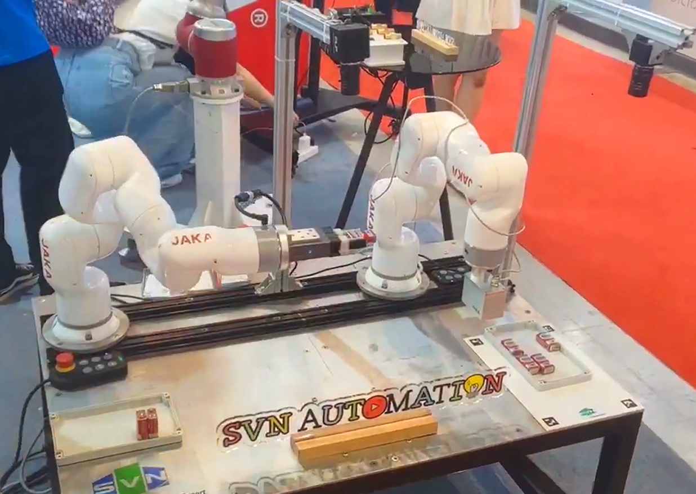

[![Facebook][facebook-shield]][facebook-url]
[![Content Page][contentpage-shield]][contentpage-url]
[![LinkedIn][linkedin-shield]][linkedin-url]
[![Home Page][homepage-shield]][homepage-url]
[![Github][github-shield]][github-url]

<!-- PROJECT LOGO -->
 
  

<h3 align="center">Battery Sorting Station - SVN Automation</h3>
  

    <a href="https://github.com/DAIVU98/SVN-PIN-STATION"><strong>Github docs »</strong></a>
     
    <a href="https://github.com/DAIVU98/SVN-PIN-STATION/issues/new?labels=bug&template=bug-report---.md">Report Bug</a>
    &middot;
    <a href="https://github.com/DAIVU98/SVN-PIN-STATION/issues/new?labels=enhancement&template=feature-request---.md">Request Feature</a>
  

<!-- TABLE OF CONTENTS -->

  
Table of Contents

  <ol>
    <li>
      <a href="#about-the-project">About The Project</a>
      <ul>
        <li><a href="#built-with">Built With</a></li>
      </ul>
    </li>
    <li>
      <a href="#getting-started">Getting Started</a>
      <ul>
        <li><a href="#prerequisites">Prerequisites</a></li>
        <li><a href="#installation">Installation</a></li>
      </ul>
    </li>
    <li><a href="#usage">Usage</a></li>
    <li><a href="#roadmap">Roadmap</a></li>
    <li><a href="#contributing">Contributing</a></li>
    <li><a href="#license">License</a></li>
    <li><a href="#contact">Contact</a></li>
    <li><a href="#acknowledgments">Acknowledgments</a></li>
  </ol>

<!-- ABOUT THE PROJECT -->

## About The Project

<!--

  

-->

  <!-- No web share, accelerometer, gyroscope, clipboard-write because theyre not supported by QWebEngineView-->  
  <!-- Turned off autoplay due to low rendering-->

[Watch our youtube video here](https://www.youtube.com/watch?v=JaT667Cp2rM)

  <video width="448" height="252" controls loop>
    <source src="./assets/demo.webm" type="video/webm" />
  </video>

<!-- Iframe doesn't work on Github, very sad
<iframe width="448" height="252" src="https://www.youtube.com/embed/JaT667Cp2rM?loop=1" frameborder="0" > </iframe> -->

This project focuses on building a demo of a fully automated battery sorting station that combines precise mechanical operation with camera vision. The system features two JAKA MiniCobots and two high-resolution industrial cameras with a main UI to display the system status and a settings UI for more advanced control of the system.

The backend controls both Arms running simultaneously through multiprocessing and a state machine that ensures no collision in their trajectory. Both cameras are controlled with QThreads to integrate with the Qt App's event loop. The YOLO detection model mainly spot red batteries and classify them as (1) whereas other colors are classified as (2). After being classified, each type is placed in their respective line.

The frontend is built using PyQt5 with some external widgets: QCodeEditor and QWebEngineView.

<ul>
  <li>The main UI provides:</li>
    <ul>
      <li>Realtime feedback from both cameras</li>
      <li>Image captured from 6 sides of the battery</li>
      <li>Status of both Arms</li>
      <li>A table for information logging.</li>
    </ul>
  <li>The settings UI consists of 3 tabs:</li>
  <ul>
    <li>Basic:</li>
    <ul>
      <li>Arm configurations (IP, speed, acceleration and ports)</li>
      <li>Camera configurations (ID, calibration, detection, ArUco markers and pickup zone)</li>
    </ul>
    <li>Advanced:</li>
    <ul>
      <li>Full control of YAML configuration files</li>
      <li>Arm's position, orientation and user coordinates</li>
      <li>More camera detection configurations</li>
    </ul>
    <li>About:</li>
    <ul>
      <li>This README Markdown document embedded into Qt's QWebEngineView Widget</li>
    </ul>
  </ul>
</ul>

### Built With

[![Python]][python-url]
[![OpenCV]][opencv-url]
[![YOLO]][yolo-url]
[![PyQt5]][pyqt5-url]
[![JAKA]][jaka-url]
[![PyInstaller]][pyinstaller-url]

<!-- GETTING STARTED -->

## 🐢 Getting Started

### 🛠️ Prerequisites

Before setting up this demo, ensure the following requirements are met:

- **Hardware Requirements:**

  - 2× **JAKA MiniCobot**
  - 2× **Industrial cameras** equipped with **50mm–5mm adjustable lenses**
  - **JAKA VAC** and **Gripper**

- **Operating System:**

  - Windows 10 64-bit or newer

- **Visual C++ Redistributable 2013 (x64):**

  - [Download from Microsoft](https://aka.ms/highdpimfc2013x64enu)

- **Network Setup:**

  - A **network switch** is required to connect both JAKA Mini cobots
  - Set the switch's configuration as follows:

### 🚀 Installation

Follow these steps to set up and run the application:

1. **Download the application**  
   Get the latest version from the [Releases page](https://github.com/DAIVU98/SVN-PIN-STATION/releases)<!--(https://caocap.dev)-->

2. **Extract the ZIP archive**  
   Unzip the downloaded file to any folder of your choice.  
   No installation is required — the application is fully portable.

3. **Run the application**  
   Inside the extracted folder, double-click `FullBatteryApp.exe` to launch the program.

## ⚙️ Statiom Setup

### Preparation

- We will use the demo table of SVN Automation with dimensions as follow:

  

- You will need to print a A4 mica plate using [this](./ArUco/4ArUco.pdf) file, then attach a 12x20cm tray to the mica plate.

  

- And two [3D printed extensions for the gripper](./assets/gripper.stl)

  

### Mounting & Wiring

> ⚠️ **Caution: All dimensions and offsets as shown are only rough estimates, you will need to do further calibrations to make the demo work as expected**

#### 1. Mounting Position and Orientation

- Slide each Arm's base onto the guide rail.
- Align each Arm's **power cable** (their X axis) according to the images.
- Position each Arm by their offsets. (You do not need to be too precise as you will have to recalibrate them later)
- Tighten the base clamps evenly. (finger‑tight and 1⁄4 turn with a wrench)

    
    

#### 2. Arm's Tool Installation

- Connect each Arm to the app according to their IP address. (Default IP is already set in the YAML Config)
- Home both Arms for the correct tool flange orientation.

> ⚠️ **Caution: If the Arm does not fully align perpendicular to the guide rail and the table, DO NOT install tools nor run the station. Contact developers for system-related problems and JAKA technicians for robot-related problems**

#### 2.1 Arm 1 (Vacuum Tool)

1. Mount the vacuum tool plate to the flange using four M4 screws.
2. Route the vacuum cable into the main cabinet’s **DO4** port.
3. Secure the cable with zip ties to avoid tangling.
4. Verify the flange is level (use a small spirit level under the tool plate).

#### 2.2 Install Arm 2 (Gripper Tool)

1. Mount the 3D printed extensions to the gripper with **two M4 screws**.
2. Mount the gripper to the flange using **four M4 screws**.
3. Plug the gripper’s cable into the **Tool I/O port on Joint 6**.
4. Bundle the cable upward and secure it to the Arm with zip ties.
5. Check that the gripper jaws can open/close freely by hand **before being powered**.

    
    

#### 3. Camera

The system consists of **two cameras**:

- **Detection Camera** – mounted above the battery tray to locate their position (named Cam Pos in settings)
- **Capture Camera** – positioned to capture the battery during the robot’s transfer stage (named Cam Shot in settings)

#### 4. Mount Securely

- Place the battery tray at the right corner of the table and secure with 2 sided tape.
- Firmly fix both cameras using stable brackets.
- Position the **detection camera** above the battery tray.
- Position the **capture camera** where it can clearly see the battery during battery transfer.
- Make sure neither camera can shift during operation.

#### II. Calibration Procedure

#### 1. Adjust Lens

- Use the 50–5mm lens to zoom in or out as needed.
- For the **detection camera**, make sure all **4 ArUco tags** are fully visible.
- For the **capture camera**, adjust while the robot places the battery to ensure it's centered and clearly seen.
- Adjust the **focus ring** until the image is sharp on both cameras.
- Once set, **lock both the focal length and focus** to prevent accidental changes.

#### 2. Verify Camera Feed

- If the live feed doesn't show both cameras, go into settings and change the camera ID.
- Use the live feed to confirm:

  - The **detection camera** shows all ArUco tags clearly and in focus.
  - The **capture camera** updates in realtime (further in the calibration process will require adjusting for getting a clear capture of the battery).

    > ⚠️ Ensure there is enough lighting for the **detection camera**.

  - Place a couple of batteries inside the battery tray and adjust the camera, lighting until the camera can draw a decent bounding box around each battery with minimal error.

    > ⚠️ All batteries must be laid down on their largest face

#### 3. User Coordinate Offset

- How to visualize the coordinate system:

  - Take Arm 1's X axis and draw a perpendicular Y axis counter-clockwise from the X axis. Click [here](https://automaticaddison.com/coordinate-frame-basics-and-the-right-hand-rule-of-robotics/) for the right-hand rule representation of the Oxyz coordinate system (Cartesian).
  - The Z axis is perdendicular to both X and Y axes, pointing upwards (This can be visualized in the original JAKA App)
  - The original user coordinate sits right where the Arm's coordinate system is at (the one you just visualized)
  - Move forward the **X axis** by **249mm** and move downward the **Y axis** by **515mm**, push down the **Z axis** by **30mm**.
  - This leaves you with a coordinate system offset by **`[249, -515, -30]`**.
  - Now turn the coordinate system 90 degrees counter-clockwise.
  - The result will be: **`[249, -515, -30, 0, 0, 90]`**

> ⚠️ All positions are measured in the unit: **milimeters (mm)**.

  

- The result is a coordinate system located at the corner of the table portrayed in the image above:

  - 515mm offset colored in **red** (stands for **X**)
  - 249mm offset colored in **green** (stands for **Y**)

- Now do the same for Arm 2 to sync both Arms' coordinate system.
- The result will be: **`[901, -515, -30, 0, 0, 90]`**

  > ⚠️ Although Arm 2 is mounted **45 degrees counter-clockwise** from Arm 1, the mounting position has been set for Arm 2 to match Arm 1's orientation.

    

- How to calibrate the user coordinate system:
  - Place 1 test battery inside the battery tray.
  - Press **"Start system"** in the main app.
  - Wait until Arm 1 is in position to pick up the battery.
  - Press **"Stop system"** in the main app.
  - Assess whether the vacuum's suction nozzle is in the center of the battery.
  - Adjust the X and Y offset and repeat until the precision error is minimal.

> ⚠️ You will now use this coordinate system as reference for every other positions in the YAML configuration file.

#### 3. Verify Capture View

- Press "Start system" and let the robot arm run until it is at the first capture position.
- Press "Stop system" and adjust the camera lens, position and orientation for a clear view of the battery face.
- If moving the camera is not feasible, you can adjust the position of the robot arm via YAML file: **(not recommended unless you understand what you're doing)**
  - Go to the settings window, select "Advanced".
  - Find **"mini"**, **"0"** represents **Arm 1** and **"1"** represents **Arm 2**.
  - The capture position for both Arms is named **"tcp_end_position"**.
  - Adjust according to the user coordinate system and rerun.

> After finishing this procedure, your station should be ready to run the full sorting sequence. If something goes wrong, immediately press "Stop system" and traceback what went wrong.

### Extra Calibration Procedure

- If the station did not work as expected, you can try adjusting the parameters according to each problem below:

#### 1. Sudden Arm Stops

- The speed might be too fast, try lowering linear and rotational speed.

#### 2. Arm Collision

- Lowering speed and acceleration might help.
- Contact a technician, this might be a hardware problem.

#### 3. Arm's home position is incorrect

- This is definitely a hardware problem, the problem could be due to joint misalignment.
- Refer to the [JAKA MiniCobo Joint Calibration Manual](https://www.jaka.com/prod-api/common/preview?filePath=%2Fprofile%2Fupload%2F2025%2F06%2F03%2F20250603161205A055.pdf) at its [resource center](https://www.jaka.com/en/download).

#### 4. Battery Recognition is incorrect

- Ensure enough lighting is provided.
- Ensure the camera can see the battery faces clearly.
- Some batteries placed in the corner can be hard to detect, this is the yolo model's limitation. If you have the patience to train a new model, place the detection file inside this folder path **`%PROJECT_ROOT%/camera/model/`**. Your model will be available for selection after you reset the application.
- If the battery tray appears to be curvy, you can flatten it out by recalibrating the camera in the **Camera** section of the **Basic** tab in the settings window. Add a name for the calibration file, press the calibrate button and wait until it is finished. You will be able to select the calibration file in the dropdown.

<!-- CONTACT -->

## Contact

- Contact Mr. Hoang Duc Minh and Mr. Ngo Tien Tu for technical assistance.
- In case of app, system or station malfunction, contact [Nguyen Phuoc Khang](https://facebook.com/KhgPh) and [Tran Cao Cap](https://caocap.dev) for assistance.

> Project Link: [https://github.com/DAIVU98/SVN-PIN-STATION](https://github.com/DAIVU98/SVN-PIN-STATION)

<!-- ACKNOWLEDGMENTS -->

## Acknowledgments

- Mr. Hoang Duc Minh: Initial UI layout & logging table, Displaying camera captures, Gripper 3D model
- Nguyen Phuoc Khang: improve main UI, settings UI, configuration file managing, Cobot trajectory, Full system operation, Documentation, UI Tester, Project manager
- Tran Cao Cap: Battery detection, Aruco calibration, Defisheye, Refactor all system code, build executable, UX Tester, Project manager
- Hoang Ngoc An, Mr. Ngo Tien Tu: Detection model training, Data gathering
- All other interns: Data gathering, System assembly, Scratch code API

<!-- MARKDOWN LINKS & IMAGES -->
<!-- https://www.markdownguide.org/basic-syntax/#reference-style-links -->
<!-- shields badge generation guide https://shields.io/badges -->

[facebook-shield]: https://img.shields.io/badge/Facebook-3D82ED?style=for-the-badge&logo=facebook&logoColor=white
[contentpage-shield]: https://img.shields.io/badge/Content_Page-rgb(229,54,74)?style=for-the-badge&logo=facebook&logoColor=white
[homepage-shield]: https://img.shields.io/badge/Home_Page-rgb(117,192,31)?style=for-the-badge&logo=googlehome&logoColor=white
[github-shield]: https://img.shields.io/badge/Github-black?style=for-the-badge&logo=github&logoColor=white
[linkedin-shield]: https://img.shields.io/badge/LinkedIn-0A66C2?style=for-the-badge&logo=linkedin

<!---------------------------------------------------------------->

[facebook-url]: https://www.facebook.com/SVNAutomation
[contentpage-url]: https://www.facebook.com/profile.php?id=61576866227424
[homepage-url]: https://svnautomation.com/en/
[github-url]: https://github.com/DAIVU98/SVN-PIN-STATION
[linkedin-url]: https://linkedin.com/company/svn-automation-company-limited

<!---------------------------------------------------------------->

[Python]: https://img.shields.io/badge/Python-3670A0?style=for-the-badge&logo=python&logoColor=white
[OpenCV]: https://img.shields.io/badge/OpenCV-27338e?style=for-the-badge&logo=opencv&logoColor=white
[YOLO]: https://img.shields.io/badge/YOLO-FFCE00?style=for-the-badge&logo=yolo&logoColor=black
[PyQt5]: https://img.shields.io/badge/PyQt5-005C93?style=for-the-badge&logo=qt&logoColor=white
[JAKA]: https://img.shields.io/badge/-JAKA-FF0000?style=for-the-badge&labelColor=ffffff&logo=
[PyInstaller]: https://img.shields.io/badge/-PyInstaller-3776AB?style=for-the-badge&logo=pyinstaller&logoColor=white

<!---------------------------------------------------------------->

[python-url]: https://www.python.org/
[opencv-url]: https://opencv.org/
[yolo-url]: https://www.v7labs.com/blog/yolo-object-detection
[pyqt5-url]: https://pypi.org/project/PyQt5/
[jaka-url]: https://www.jaka.com/en/index
[pyinstaller-url]: https://www.pyinstaller.org/
